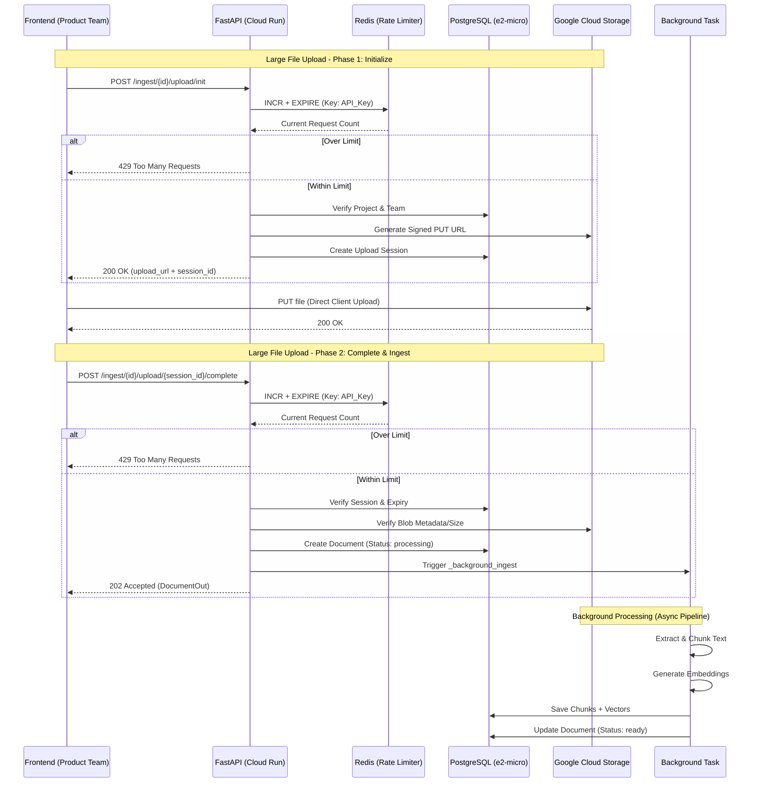

```mermaid
    sequenceDiagram
    participant FE as Frontend (Product Team)
    participant API as FastAPI (Cloud Run)
    participant Redis as Redis (Rate Limiter)
    participant DB as PostgreSQL (e2-micro)
    participant GCS as Google Cloud Storage
    participant Worker as Background Task

    rect rgba(240, 240, 240, 0.1)
    Note over FE, GCS: Large File Upload - Phase 1: Initialize
    FE->>API: POST /ingest/{id}/upload/init
    
    API->>Redis: INCR + EXPIRE (Key: API_Key)
    Redis-->>API: Current Request Count

    alt Over Limit
        API-->>FE: 429 Too Many Requests
    else Within Limit
        API->>DB: Verify Project & Team
        API->>GCS: Generate Signed PUT URL
        API->>DB: Create Upload Session
        API-->>FE: 200 OK (upload_url + session_id)
    end
    end
    
    FE->>GCS: PUT file (Direct Client Upload)
    GCS-->>FE: 200 OK

    rect rgba(240, 240, 240, 0.1)
    Note over FE, GCS: Large File Upload - Phase 2: Complete & Ingest
    FE->>API: POST /ingest/{id}/upload/{session_id}/complete
    
    API->>Redis: INCR + EXPIRE (Key: API_Key)
    Redis-->>API: Current Request Count

    alt Over Limit
        API-->>FE: 429 Too Many Requests
    else Within Limit
        API->>DB: Verify Session & Expiry
        API->>GCS: Verify Blob Metadata/Size
        API->>DB: Create Document (Status: processing)
        API->>Worker: Trigger _background_ingest
        API-->>FE: 202 Accepted (DocumentOut)
    end
    end
    
    Note over Worker, GCS: Background Processing (Async Pipeline)
    Worker->>Worker: Extract & Chunk Text
    Worker->>Worker: Generate Embeddings
    Worker->>DB: Save Chunks + Vectors
    Worker->>DB: Update Document (Status: ready)
```