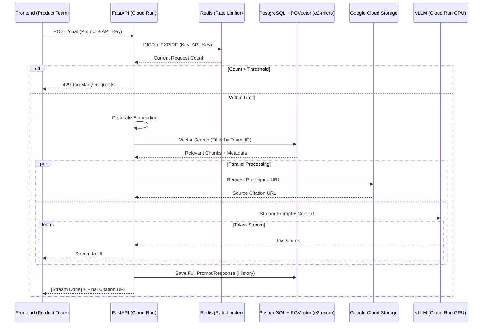

```mermaid
    sequenceDiagram
    participant FE as Frontend (Product Team)
    participant API as FastAPI (Cloud Run)
    participant Redis as Redis (Rate Limiter)
    participant DB as PostgreSQL + PGVector (e2-micro)
    participant GCS as Google Cloud Storage
    participant GPU as vLLM (Cloud Run GPU)

    FE->>API: POST /chat (Prompt + API_Key)

    API->>Redis: INCR + EXPIRE (Key: API_Key)
    Redis-->>API: Current Request Count

    alt Count > Threshold
        API-->>FE: 429 Too Many Requests
    else Within Limit
        
        rect rgba(240, 240, 240, 0.1)
            API->>API: Generate Embedding
            
            API->>DB: Vector Search (Filter by Team_ID)
            DB-->>API: Relevant Chunks + Metadata
            
            par Parallel Processing
                API->>GCS: Request Pre-signed URL
                GCS-->>API: Source Citation URL
            and
                API->>GPU: Stream Prompt + Context
                loop Token Stream
                    GPU-->>API: Text Chunk
                    API-->>FE: Stream to UI
                end
            end
            
            API->>DB: Save Full Prompt/Response (History)
        end
        
        API-->>FE: [Stream Done] + Final Citation URL
    end
```
