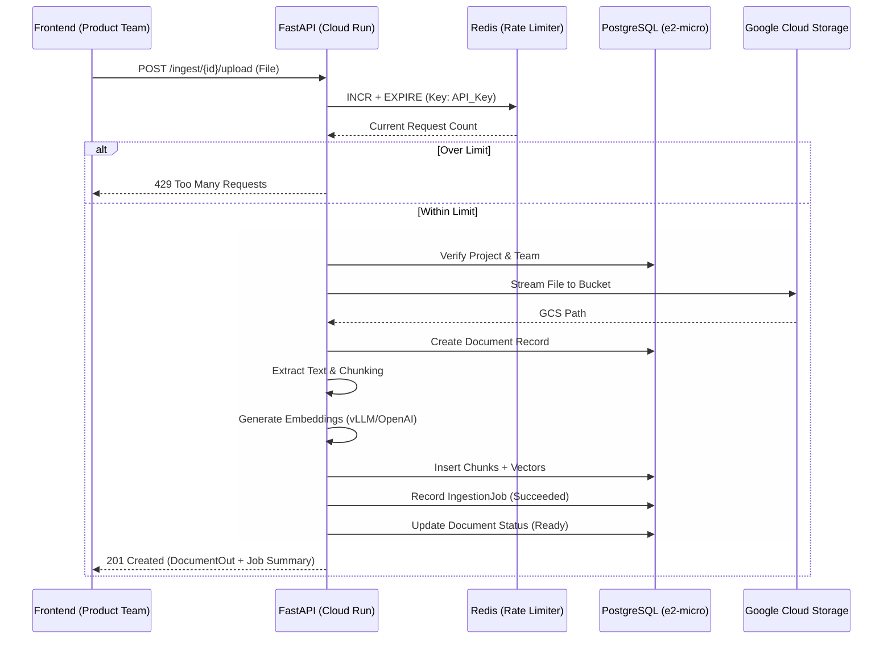

```mermaid
    sequenceDiagram
    participant FE as Frontend (Product Team)
    participant API as FastAPI (Cloud Run)
    participant Redis as Redis (Rate Limiter)
    participant DB as PostgreSQL (e2-micro)
    participant GCS as Google Cloud Storage

    FE->>API: POST /ingest/{id}/upload (File)
    
    API->>Redis: INCR + EXPIRE (Key: API_Key)
    Redis-->>API: Current Request Count

    alt Over Limit
        API-->>FE: 429 Too Many Requests
    else Within Limit
        rect rgba(240, 240, 240, 0.1)
            API->>DB: Verify Project & Team
            
            API->>GCS: Stream File to Bucket
            GCS-->>API: GCS Path
            
            API->>DB: Create Document Record
            
            API->>API: Extract Text & Chunking
            API->>API: Generate Embeddings (vLLM/OpenAI)
            
            API->>DB: Insert Chunks + Vectors
            API->>DB: Record IngestionJob (Succeeded)
            API->>DB: Update Document Status (Ready)
        end
        
        API-->>FE: 201 Created (DocumentOut + Job Summary)
    end
```